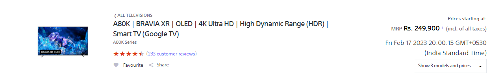
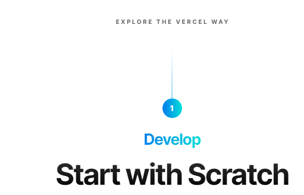
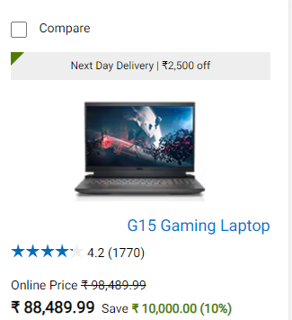

# Dom Manipulation Assignment

1. Webiste Name: [Dev To](https://dev.to/)

### Topics

    - Query Selctory, Inner HTML

### Sample Image

### Tasks

        Target the Top description div and change the DEV Community to <Your_Name> and description to your passion

### Output

### Code For OutPut

     var e = document.querySelector('.crayons-card .crayons-subtitle-2').innerHTML="Ved Dadhich";

     var d = document.querySelector('.crayons-card p').innerHTML="I like to Code";

2. Webiste Name: [Oppo](https://www.oppo.com/in/)

### Topics

          querySelector,style,color

### Sample Image

### Tasks

      Change the description colour black to orange

### Output

### Code For OutPut

     var e = document.querySelector('.product-card-content .narrow .item .desc').style.color="red";

3. Webiste Name: [Canon](https://in.canon/)

### Topics

          querySelector,src

### Sample Image

### Tasks

    extract the canon logo

### Output

### Code For OutPut

     var e = document.querySelector('.navbar-header .navbar-brand .logo').getAttribute('src');
     console.log(e);

4. Webiste Name: [Philips](https://www.philips.co.in/)

### Topics

     querySelector,style,backgroundcolor

### Sample Image

### Tasks

    change the background colour blue to orange

### Output

### Code For OutPut

        var e = document.querySelector('.p-footer .p-grid').style.backgroundColor="orange";

5. Webiste Name: [Sony](https://www.sony.co.in/)

### Topics

    querySelector,innerHTMl

### Sample Image

### Tasks

     change the button text To current Date.

### Output

### Code For OutPut

       var e = document.querySelector('.mlp-collapse-content .btn-container').innerHTML= new Date();

6. Webiste Name: [Vercel](https://vercel.com/)

### Topics

     querySelector,innerHTMl

### Sample Image

### Tasks

      change the heading “Start with the developer” to “Start with Scratch”

### Output

### Code For OutPut

       var e = document.querySelector('.jsx-499702677 .section-title_title__VEDfK').innerHTML="Start with Scratch";

7. Webiste Name: [Dell](https://www.dell.com/en-in/shop/deals/laptop-deals?gacd=10415953-9016-5761040-285981356-0&dgc=ST&gclid=Cj0KCQjwguGYBhDRARIsAHgRm4-XUDMhhVNyHXb3s1gY4ZBzORr_d9Se-buhJwy7asyUe7YdqEA11eEaAt6UEALw_wcB&gclsrc=aw.ds&nclid=BxjBlpBQsX6pjSHh-L8YYSU77EpfXRkG1AGMB5Wbeu386ykspfrPDnfx_DdFau20)

### Topics

      querySelector,style.textAlign

### Sample Image

### Tasks

       Convert the text “G15 Gaming Laptop” from left to right

### Output

### Code For OutPut

       var e = document.querySelector('#d560822win9b .ps-top .ps-title').style.textAlign="right";
