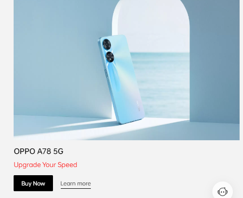

# Dom Manipulation Assignment

1. Webiste Name: [Dev To](https://dev.to/)

### Topics

    - Query Selctory, Inner HTML

### Sample Image

### Tasks

        Target the Top description div and change the DEV Community to <Your_Name> and description to your passion

### Output

### Code For OutPut

     var e = document.querySelector('.crayons-card .crayons-subtitle-2').innerHTML="Ved Dadhich";

     var d = document.querySelector('.crayons-card p').innerHTML="I like to Code";

2. Webiste Name: [Oppo](https://www.oppo.com/in/)

### Topics

          querySelector,style,color

### Sample Image

### Tasks

      Change the description colour black to orange

### Output

### Code For OutPut

     var e = document.querySelector('.product-card-content .narrow .item .desc').style.color="red";

3. Webiste Name: [Canon](https://in.canon/)

### Topics

          querySelector,src

### Sample Image

### Tasks

    extract the canon logo

### Output

### Code For OutPut

     var e = document.querySelector('.navbar-header .navbar-brand .logo').getAttribute('src');
     console.log(e);
